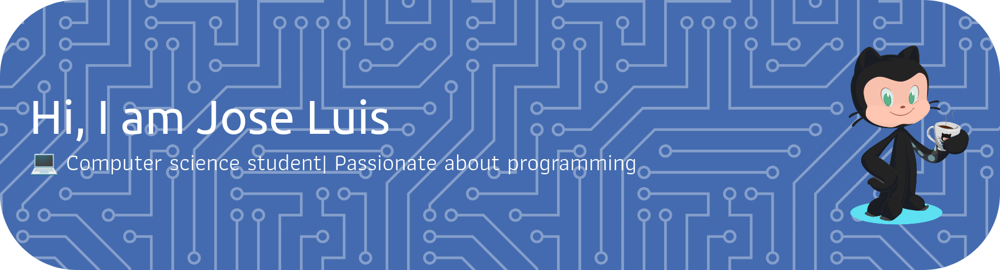

<h1 align="center"></h1>
<h3 align="center"></h3>

---

 

## LANGUAGES AND TOOLS

 
 

<code></code>
<code></code>
<code></code>
<code></code>
<code></code>
<code></code>
<code></code>

#

<code></code>
<code></code>

---

<h1 align="center">
Connect With Me

</h1>

<a href="https://www.linkedin.com/in/JayantGoel001/" target="_blank">
<code></code>
</a>

<a href="https://www.facebook.com/jayant.goel.12/" target="_blank">
<code></code>
</a>

<a href="https://www.instagram.com/jayantgoel001/" target="_blank">
<code></code>
</a>

<a href="https://twitter.com/JayantGoel001" target="_blank">
<code></code>
</a>

<a href="https://dev.to/jayantgoel001">
<code></code>
</a>

